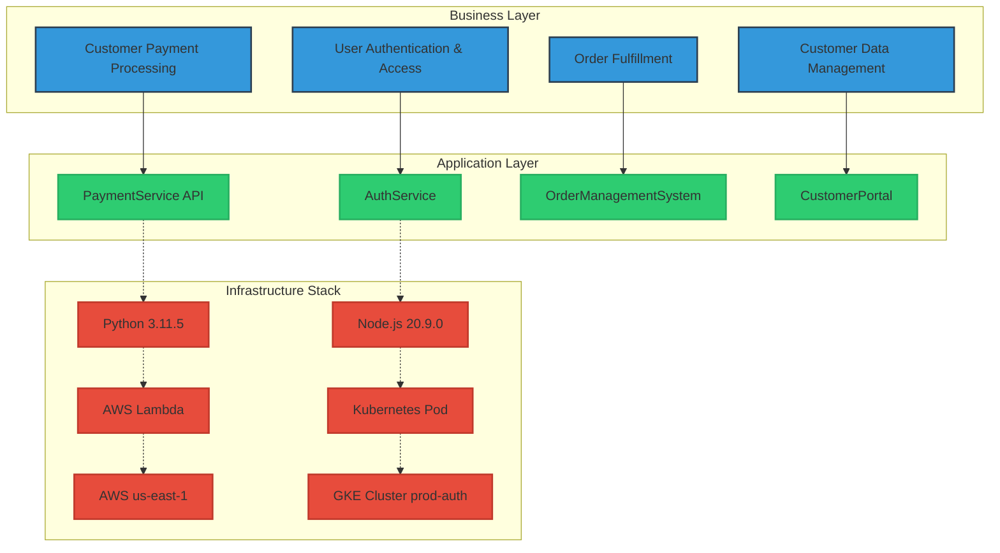
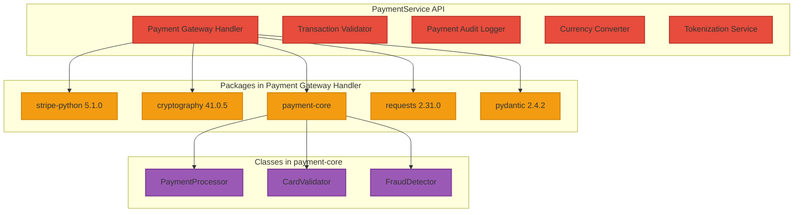
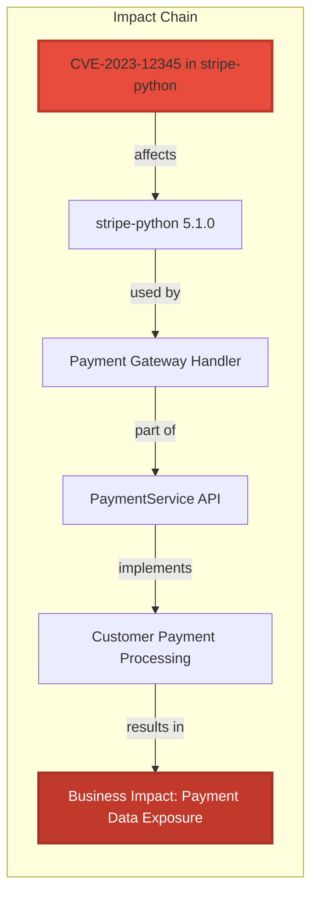
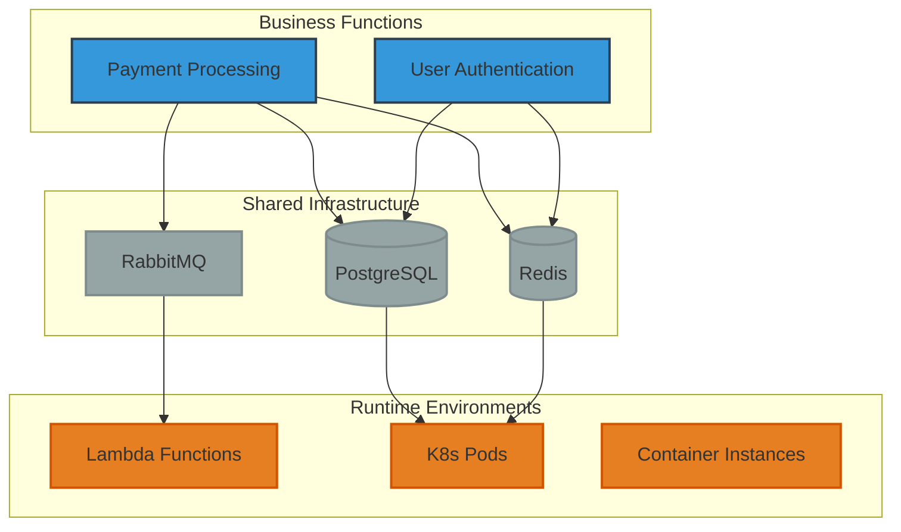
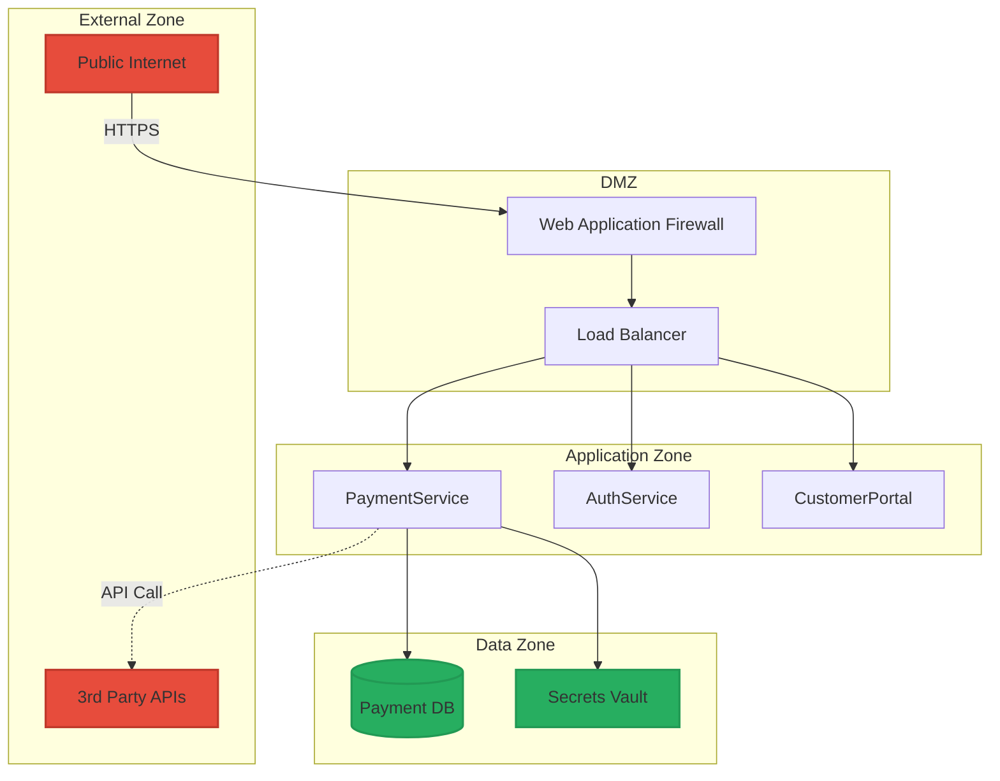
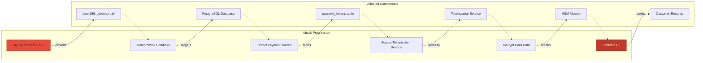
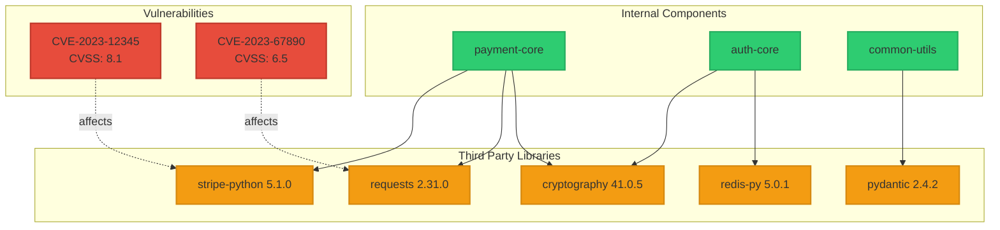
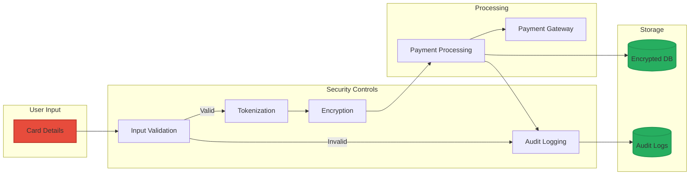

# Threat Modeling Knowledge Graph Diagrams

## 1. High-Level Business to Infrastructure Flow

## 2. Payment Service Deep Dive

## 3. Code Execution Flow

```mermaid
graph LR
    subgraph "PaymentProcessor Class"
        M1[process_payment]
        M2[validate_card_details]
        M3[check_fraud_score]
        M4[encrypt_sensitive_data]
    end
    
    subgraph "Code Lines"
        L1[Line 142: tokenize card]
        L2[Line 145: calculate fraud score]
        L3[Line 148: check threshold]
        L4[Line 152: encrypt payload]
        L5[Line 156: call gateway]
    end
    
    subgraph "Execution Environment"
        ENV[Python 3.11.5]
        RT[AWS Lambda]
        COMP[AWS us-east-1]
    end
    
    M1 --> L1
    M1 --> L2
    M1 --> L3
    M1 --> L4
    M1 --> L5
    
    L1 --> ENV
    L2 --> ENV
    L3 --> ENV
    L4 --> ENV
    L5 --> ENV
    
    ENV --> RT
    RT --> COMP
    
    classDef method fill:#1abc9c,stroke:#16a085,stroke-width:2px
    classDef code fill:#34495e,stroke:#2c3e50,stroke-width:2px
    classDef env fill:#16a085,stroke:#138d75,stroke-width:2px
    
    class M1,M2,M3,M4 method
    class L1,L2,L3,L4,L5 code
    class ENV,RT,COMP env
```

## 4. Threat Propagation Example

## 5. Cross-Layer Dependencies

## 6. Security Zones and Trust Boundaries

## 7. Attack Path Visualization

## 8. Component Dependency Graph

## 9. Runtime Environment Mapping

```mermaid
graph TB
    subgraph "Code Artifacts"
        CODE1[payment-service.py]
        CODE2[auth-service.js]
        CODE3[fraud-detector.go]
    end
    
    subgraph "Container Images"
        IMG1[payment:v2.3.1]
        IMG2[auth:v1.8.5]
        IMG3[fraud:v3.0.2]
    end
    
    subgraph "Runtime Instances"
        RT1[Lambda: payment-prod]
        RT2[Pod: auth-deployment-7d9f]
        RT3[CloudRun: fraud-detector]
    end
    
    subgraph "Compute Resources"
        COMP1[AWS Account: 123456]
        COMP2[GKE Cluster: prod-main]
        COMP3[GCP Project: fraud-ml]
    end
    
    CODE1 --> IMG1
    CODE2 --> IMG2
    CODE3 --> IMG3
    
    IMG1 --> RT1
    IMG2 --> RT2
    IMG3 --> RT3
    
    RT1 --> COMP1
    RT2 --> COMP2
    RT3 --> COMP3
    
    classDef code fill:#34495e,stroke:#2c3e50,stroke-width:2px
    classDef image fill:#3498db,stroke:#2980b9,stroke-width:2px
    classDef runtime fill:#e67e22,stroke:#d35400,stroke-width:2px
    classDef compute fill:#c0392b,stroke:#a93226,stroke-width:2px
    
    class CODE1,CODE2,CODE3 code
    class IMG1,IMG2,IMG3 image
    class RT1,RT2,RT3 runtime
    class COMP1,COMP2,COMP3 compute
```

## 10. Data Flow and Security Controls

These diagrams can be rendered using any Mermaid-compatible tool or documentation platform. Each diagram focuses on a different aspect of the threat modeling knowledge graph:

1. **High-Level Flow**: Shows the complete stack from business to infrastructure
2. **Payment Service Deep Dive**: Details one service's component structure
3. **Code Execution Flow**: Traces from methods to infrastructure
4. **Threat Propagation**: Shows how vulnerabilities cascade up
5. **Cross-Layer Dependencies**: Illustrates shared resources
6. **Security Zones**: Maps trust boundaries
7. **Attack Paths**: Visualizes potential attack sequences
8. **Component Dependencies**: Shows library relationships and vulnerabilities
9. **Runtime Mapping**: Connects code to running instances
10. **Data Flow**: Shows security controls in the processing pipeline

Each diagram can be customized further based on your specific threat modeling needs!